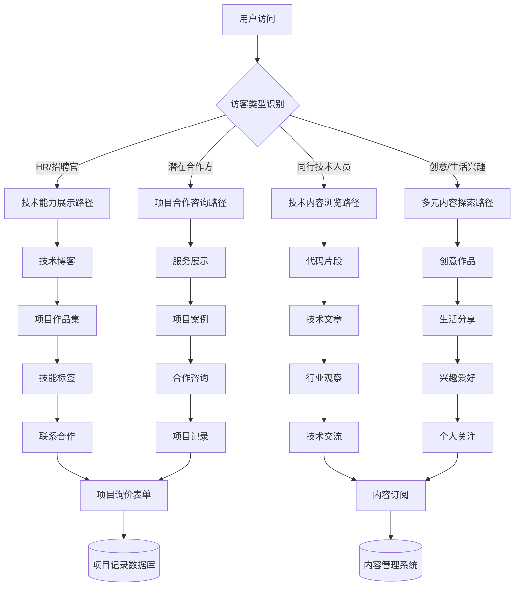
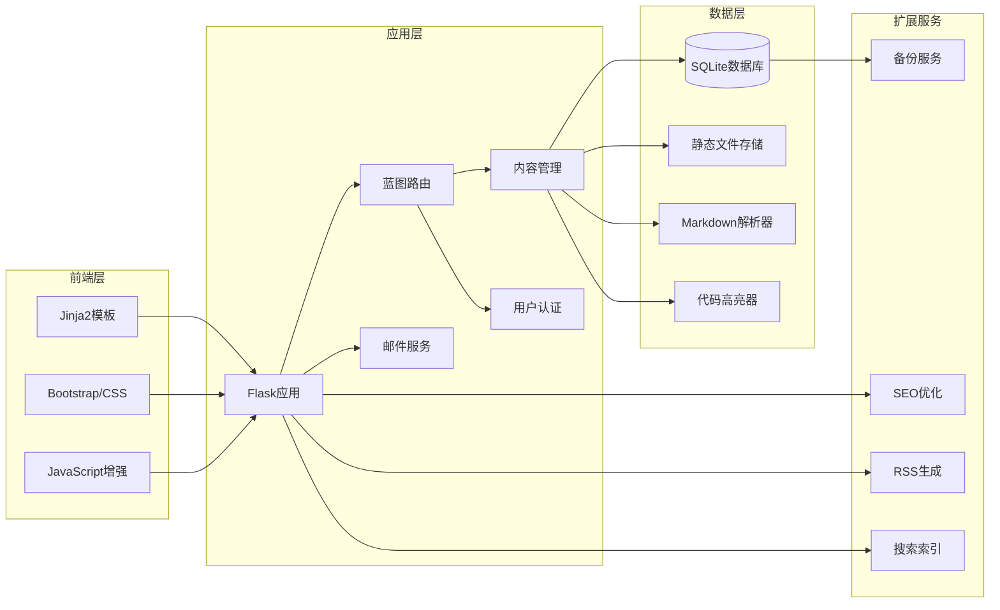

# 个人门户网站产品需求文档 (PRD)

## 📋 项目概述

**项目名称**: 个人多元化门户网站  
**项目类型**: 个人品牌展示 + 内容分享 + 项目合作平台  
**技术栈**: Flask + SQLite + Bootstrap  
**设计理念**: 多元内容中心型 (原型B)  

---

## 🎯 产品路线图 (Product Roadmap)

### 核心目标 (Mission)
打造一个以**招聘展示为核心**的个人技术门户，通过**多元化内容**（技术+创意+生活）展示**全面专业能力**，同时提供技术交流和项目合作机会。

### 用户画像 (Persona)

**主要用户群体：**

1. **HR/技术招聘官 (70%)** - 主要目标  
   - **核心需求**: 全面了解技术人员的专业能力和个人素质
   - **关注内容**: 技术博客、项目作品、技能展示、个人特质
   - **行为路径**: 技术能力 → 项目案例 → 个人品牌 → 联系合作

2. **同行技术人员 (20%)**  
   - **核心需求**: 技术交流学习和行业观察
   - **关注内容**: 技术博客、代码片段、行业观察、创意分享
   - **行为路径**: 技术内容 → 代码实例 → 行业思考 → 关注订阅

3. **潜在合作方/客户 (10%)**  
   - **核心需求**: 寻求技术服务和创意合作
   - **关注内容**: 项目案例、服务能力、创意作品、合作方式
   - **行为路径**: 项目展示 → 能力评估 → 合作咨询 → 项目记录

**核心用户痛点：**
- 难以全面了解技术人员的真实综合能力
- 缺乏直观的项目展示和技术实力证明  
- 找不到既有技术能力又有创意思维的合作伙伴
- 无法了解技术人员的个人品格和工作态度

---

## 🚀 版本规划

### V1: 最小可行产品 (MVP)

**核心功能优先级 (Must Have):**

1. **多元化内容系统** - 产品核心
   - 📝 **技术博客**: Markdown支持、语法高亮、技术分类
   - 📰 **行业观察**: 原创观点 + 转载评论 (标注来源)
   - 🌊 **生活分享**: 个人生活记录和思考感悟
   - 🎨 **创意作品**: 建模、3D打印、钓鱼、钩织、平面设计作品展示
   - 💼 **项目作品集**: 技术项目展示、技术栈标注、效果预览
   - 💻 **代码片段**: 多语言支持、语法高亮、分类管理

2. **内容组织系统**
   - 🏷️ **智能标签**: 技术标签 + 创意标签 + 生活标签
   - 📂 **内容分类**: 技术/观察/生活/创作/项目五大分类
   - 🔍 **内容筛选**: 按分类、标签、时间筛选
   - 📱 **响应式设计**: 移动端友好的浏览体验

3. **个人品牌展示**
   - 👤 **关于我页面**: 专业技能 + 个人特色 + 兴趣爱好
   - ⭐ **技能标签云**: 技术技能 + 创意技能可视化展示
   - 📊 **内容统计**: 文章数量、项目数量、技能分布

4. **项目合作系统** (简化版)
   - 📋 **合作咨询表单**: 基础项目需求收集
   - 📝 **项目记录管理**: 后台简单记录和状态跟踪
   - 📧 **邮件通知**: 自动邮件提醒和回复

5. **SEO和性能优化**
   - 🔍 **SEO基础**: meta标签、sitemap、结构化数据
   - ⚡ **性能优化**: 图片压缩、懒加载、缓存策略
   - 📡 **RSS订阅**: 内容更新订阅功能

### V2 及以后版本 (Future Releases)

**增强功能 (Should Have):**

- **高级内容管理**: 富文本编辑器、批量导入、定时发布
- **互动功能**: 评论系统、点赞收藏、分享功能
- **数据分析**: 访客统计、内容热度、用户行为分析
- **搜索功能**: 全文搜索、高级筛选、搜索建议
- **多语言支持**: 中英文切换、国际化内容
- **社交集成**: GitHub集成、社交媒体同步
- **在线工具**: 简历生成器、作品集PDF导出
- **高级项目管理**: 项目进度跟踪、在线报价、合同管理

---

## 🎨 选定原型设计 - 多元内容中心型

```
┌─────────────────────────────────────────────────────────────┐
│  王某某的多元世界 🌟                            [搜索] [RSS]     │
├─────────────────────────────────────────────────────────────┤
│ [全部] [技术💻] [观察📰] [生活🌊] [创作🎨] [项目💼] [关于👤]         │
├─────────────────────────────────────────────────────────────┤
│                                                           │
│ 📌 精选推荐                     🏷️ 热门标签                   │
│ ┌─────────────────────────┐    Python  Flask  React        │
│ │ 🔥 技术：Flask性能调优秘籍 │    建模   3D打印  平面设计        │
│ │ 📈 观察：前端框架选型分析   │    钓鱼   钩织   行业观察         │
│ │ 🎨 创作：钩织图案算法实现   │                             │
│ └─────────────────────────┘    👨‍💻 关于我                   │
│                              ┌─────────────────────┐       │
│ 📱 最新动态                   │ 全栈工程师 + 手工艺人 │       │
│ • 完成了新的3D打印项目          │ 技术与创意的结合者   │       │
│ • 分享Flask微服务架构心得        │ 5年+开发 | 多元爱好  │       │
│ • 钓鱼途中的产品思考            └─────────────────────┘       │
│ • [原创]行业新技术趋势解读                                   │
│ • [转载+评]AI发展现状报告                                   │
│                                                           │
│           [技术能力详情] [创意作品展示] [合作咨询]                │
└─────────────────────────────────────────────────────────────┘
```

**设计理念说明:**
- **内容分类清晰**: 技术/观察/生活/创作/项目 五大模块满足不同访客需求
- **智能标签系统**: 技术标签与创意标签并重，体现多元化特色  
- **精选推荐机制**: 突出优质内容，引导访客深度了解
- **个人品牌突出**: 右侧个人简介突出"技术+创意"的独特定位
- **互动友好**: 搜索、RSS、分类筛选提供良好用户体验

---

## 🏗️ 技术架构设计

### 核心业务流程



### 系统架构组件



### 核心技术选型

**后端架构:**
- **Web框架**: Flask + SQLAlchemy
- **数据库**: SQLite (MVP) → PostgreSQL (生产)
- **认证系统**: Flask-Login + Werkzeug
- **邮件服务**: Flask-Mail + SMTP

**前端技术:**
- **模板引擎**: Jinja2
- **UI框架**: Bootstrap 5 + 自定义CSS
- **JavaScript**: 原生JS + 少量第三方库
- **图标系统**: Bootstrap Icons

**内容处理:**
- **Markdown解析**: Python-Markdown + 扩展插件
- **代码高亮**: Pygments (支持200+编程语言)
- **图片处理**: Pillow + WebP转换
- **搜索功能**: SQLite FTS5 (MVP) → Elasticsearch (V2)

**SEO和性能:**
- **SEO优化**: Flask-SEO + 自定义meta管理
- **缓存系统**: Flask-Caching + Redis (V2)
- **静态文件**: 本地存储 → CDN (生产)

---

## 📊 关键业务逻辑

### 内容管理策略
1. **内容优先级**: 项目作品 > 技术博客 > 创意作品 > 生活分享 > 行业观察
2. **SEO策略**: 每篇内容独立URL，核心技能页面关键词优化
3. **标签系统**: 技术标签 + 兴趣标签的双重分类体系
4. **更新频率**: 技术内容为主，个人内容调节，保持持续更新

### 项目记录流程
1. **咨询表单** → 自动邮件通知 → 后台项目记录
2. **项目状态**: 咨询中 → 讨论中 → 进行中 → 已完成 → 已归档
3. **数据记录**: 客户信息、需求描述、预估工作量、项目状态、时间节点

### 用户体验策略
1. **首页设计**: 体现专业性和多元化，3秒内传达个人价值
2. **导航逻辑**: 不同类型访客的快速访问路径
3. **内容呈现**: 图文并茂，突出关键信息和联系方式

---

## 📋 数据契约 (Data Contract)

### Content内容模型
```python
Content {
    id: Integer (主键)
    title: String(200) (标题)
    content: Text (Markdown内容)
    content_html: Text (渲染后HTML)
    category: String(50) (技术/观察/生活/创作/项目)
    tags: Relationship (多对多标签关系)
    created_at: DateTime (创建时间)
    updated_at: DateTime (更新时间)
    is_published: Boolean (发布状态)
    is_featured: Boolean (精选推荐)
    source_type: String(20) (原创/转载)
    source_url: String(500) (转载来源URL)
    view_count: Integer (浏览次数)
    seo_title: String(200) (SEO标题)
    seo_description: String(300) (SEO描述)
}
```

### Project项目模型
```python
Project {
    id: Integer (主键)
    name: String(200) (项目名称)
    description: Text (项目描述)
    tech_stack: JSON (技术栈数组)
    images: JSON (项目图片数组)
    demo_url: String(500) (演示链接)
    github_url: String(500) (GitHub链接)
    completion_date: Date (完成日期)
    is_featured: Boolean (是否精选展示)
    created_at: DateTime
}
```

### ProjectInquiry项目咨询模型
```python
ProjectInquiry {
    id: Integer (主键)
    client_name: String(100) (客户姓名)
    client_email: String(100) (客户邮箱)
    client_phone: String(50) (联系电话)
    project_type: String(100) (项目类型)
    description: Text (需求描述)
    budget_range: String(50) (预算范围)
    timeline: String(100) (期望时间)
    status: String(50) (咨询状态)
    notes: Text (备注信息)
    created_at: DateTime
}
```

### Tag标签模型
```python
Tag {
    id: Integer (主键)
    name: String(100) (标签名称)
    category: String(50) (技术/创意/生活)
    color: String(20) (标签颜色)
    usage_count: Integer (使用次数)
}
```

---

## ⚠️ 技术风险与对策

### 主要风险点

1. **SEO优化挑战**
   - **风险**: Flask动态渲染可能影响搜索引擎收录
   - **对策**: 服务端渲染(SSR)，正确配置meta标签和sitemap

2. **文件上传安全**
   - **风险**: 恶意文件上传和存储空间滥用
   - **对策**: 严格文件类型验证、大小限制、病毒扫描

3. **数据库性能**
   - **风险**: SQLite在高并发下的性能瓶颈
   - **对策**: 读写分离缓存、适时升级到PostgreSQL

4. **内容备份**
   - **风险**: 单点故障导致内容丢失
   - **对策**: 定期数据库备份、文件同步、版本控制

5. **移动端体验**
   - **风险**: 复杂内容在移动端的展示效果
   - **对策**: 响应式设计测试、移动端专门优化

---

## 📈 成功指标 (KPI)

### MVP阶段目标 (3个月)
- **技术展示**: 20+ 技术博客文章
- **项目作品**: 8+ 完整项目案例展示  
- **创意内容**: 15+ 兴趣爱好和创意作品
- **SEO效果**: 核心关键词搜索排名进入前3页
- **访客转化**: 月访问量1000+，项目咨询3+ 个/月
- **用户反馈**: 技术同行正面反馈，招聘方询问

### 长期目标 (12个月)
- **内容规模**: 100+ 优质内容，涵盖技术+创意+生活
- **品牌影响**: 成为技术圈知名的多元化个人品牌
- **商业转化**: 月均项目合作2-3个，建立稳定客户群
- **技术影响**: 技术文章被转载引用，建立行业影响力

---

## 🎯 下一步行动计划

### 立即执行 (本周)
1. **项目初始化**: 创建Flask项目结构
2. **数据库设计**: 设计核心表结构和关系  
3. **基础模板**: 实现原型B的HTML/CSS基础布局
4. **内容模型**: 完成Content和Project核心模型

### 短期目标 (1个月)
1. **MVP核心功能**: 内容CRUD、分类展示、项目展示
2. **管理后台**: 简单的内容管理和项目记录界面
3. **SEO基础**: meta标签、sitemap、RSS生成  
4. **基础内容**: 准备首批技术文章和项目案例

### 中期目标 (3个月)
1. **内容丰富**: 完成MVP所需的全部内容类型
2. **用户体验**: 响应式优化、交互细节完善
3. **性能优化**: 图片处理、缓存策略、加载优化
4. **SEO提升**: 搜索引擎收录、关键词排名优化

---

## 📝 结语

这份PRD文档是我们**产品设计合作的最终蓝图**。通过深入的需求挖掘和架构设计，我们明确了一个清晰的产品方向：

✅ **多元化内容** - 技术+创意+生活的独特个人品牌  
✅ **招聘导向** - 以专业展示为核心，个人魅力为加分  
✅ **技术可行** - Flask技术栈简单可靠，适合快速开发  
✅ **商业价值** - 既能提升个人品牌，又能创造合作机会  

**现在，让我们开始将这个精彩的产品愿景变为现实！** 🚀

---

*文档版本: v1.0*  
*创建日期: 2024年1月*  
*产品设计师: Claude*